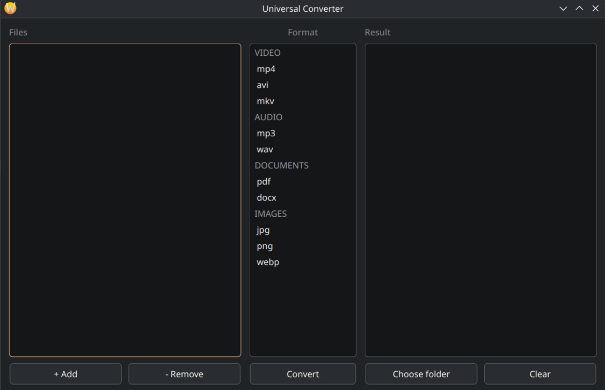
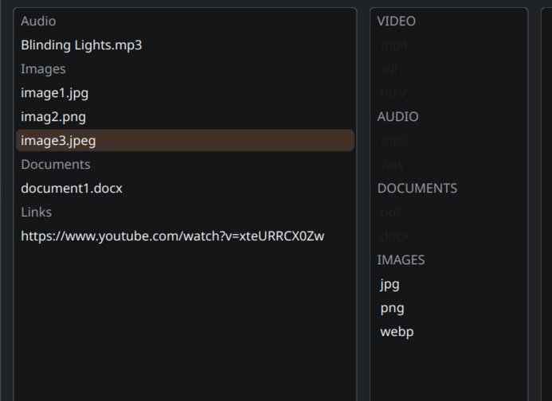
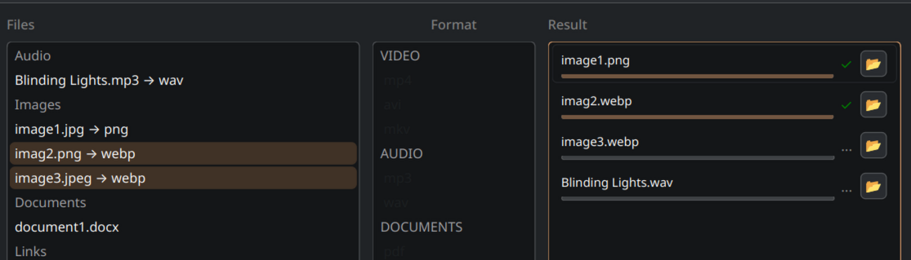

# Universal Converter

A cross-platform desktop application for converting and downloading media files, built with Qt6 and C++23.



---

## What it does

Universal Converter wraps battle-tested CLI utilities behind a clean GUI — drag in your files or paste a URL, pick a format, hit Convert.

- **Convert video** — mp4, avi, mkv
- **Convert audio** — mp3, wav
- **Convert documents** — pdf, docx
- **Convert images** — jpg, png, webp
- **Download from URLs** — paste a YouTube (or any yt-dlp-supported) link directly into the file list

FFmpeg and yt-dlp are bundled automatically at build time — no manual installation required for those.

---

## Screenshots

| Empty | Files loaded | Converting |
|-------|-------------|------------|
|  |  |  |

---

## Dependencies

| Tool | Required for | Bundled |
|------|-------------|---------|
| FFmpeg | Video, audio, image conversion | ✅ Auto-downloaded at build time |
| yt-dlp | URL downloads | ✅ Auto-downloaded at build time |
| LibreOffice | Document conversion (pdf, docx) | ❌ Install manually |

**LibreOffice installation:**

```bash
# Fedora / RHEL
sudo dnf install libreoffice

# Ubuntu / Debian
sudo apt install libreoffice
```

On Windows: download from [libreoffice.org](https://www.libreoffice.org)

If LibreOffice is not found at startup, the app will warn you — everything else still works fine without it.

---

## Building

### Requirements

- Qt 6.6+
- CMake 3.21+
- C++23-capable compiler (GCC 13+, MSVC 2022, Clang 16+)
- Internet connection on first configure (to download FFmpeg and yt-dlp)

### Linux

```bash
git clone git@github.com:GReiX-19/universal-converter.git
cd universal-converter
cmake -B build
cmake --build build
./build/bin/UniversalConverter
```

### Windows

```bash
git clone git@github.com:GReiX-19/universal-converter.git
cd universal-converter
cmake -B build -G "Visual Studio 17 2022"
cmake --build build --config Release
```

The executable and all required DLLs (Qt runtime, yt-dlp, ffmpeg) will be placed in `build/bin/Release/`.

> **Note:** On first CMake configure, FFmpeg (~80 MB) and yt-dlp will be downloaded automatically. Subsequent builds use the cached versions.

---

## How it works

The app delegates all actual conversion work to external CLI tools:

- **FFmpeg** — handles video, audio, and image conversion
- **yt-dlp** — handles URL downloads and calls FFmpeg internally for post-processing
- **LibreOffice headless** — handles document conversion

The GUI manages task queues, tracks per-file progress, and handles process lifecycle — including proper cleanup of child processes (ffmpeg spawned by yt-dlp) on cancel or app close, via process groups on Linux and Job Objects on Windows.

---

## License

MIT — see [LICENSE](LICENSE)
